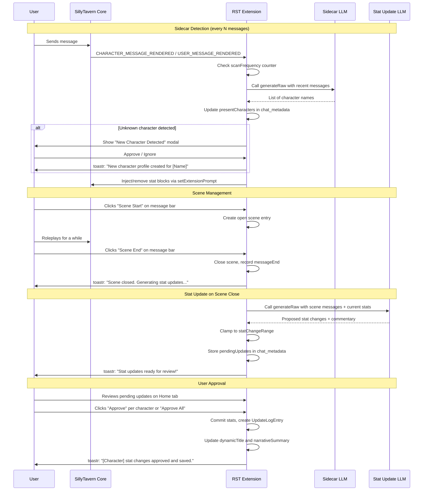
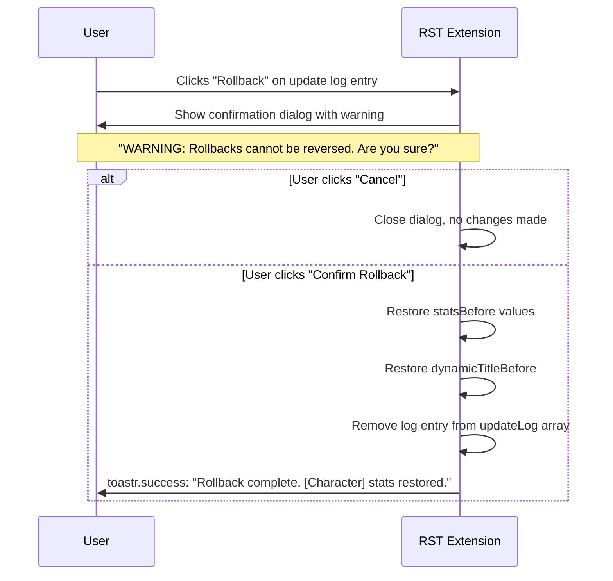

# RST (Relationship State Tracker) — Architecture Plan

## Overview

The Relationship State Tracker is a **completely new SillyTavern extension** — independent from the existing Tracker extension. It tracks relationship stats (Trust, Openness, Support, Affection across Platonic/Romantic/Sexual categories) between characters in a roleplay, using a sidecar LLM for character detection and a main LLM for stat updates on scene close.

## Project Location

`C:\Users\jacks\OneDrive\Documents\VS Coding Projects\Projects\SillyTavern-Relationship Stat Tracker`

This is the **extension root folder** — it will contain its own [`manifest.json`](manifest.json) and be installed as a separate ST extension alongside the existing Tracker.

---

## 1. File Structure

```
SillyTavern-Relationship Stat Tracker/
├── index.js                        # Extension entry point, registers with ST
├── manifest.json                   # ST extension manifest
├── style.css                       # All UI styles (replicated from mockup)
├── settings.js                     # Settings load/save from extension_settings
├── data/
│   ├── characters.js               # Character profile CRUD + stat storage
│   ├── scenes.js                   # Scene open/close + summary storage
│   └── storage.js                  # ST storage API wrapper (extension_settings + chat_metadata)
├── llm/
│   ├── sidecar.js                  # Sidecar LLM: character presence detection
│   ├── statUpdate.js               # Main LLM: scene review + stat generation
│   ├── profileGen.js               # Main LLM: character profile auto-generation
│   └── connections.js              # Pull connection profiles from ST
├── ui/
│   ├── panel.js                    # Builds/manages the 4-tab extension panel
│   ├── home.js                     # Home tab: toggle, pending updates, present chars
│   ├── library.js                  # Character Library tab: list, display, wand, logs
│   ├── scenes.js                   # Scenes tab: scene list + summaries
│   └── settings.js                 # Settings tab: all config UI
└── inject/
    └── promptInjector.js           # System prompt injection/removal of stat blocks
```

---

## 2. Architecture & Key Design Decisions

### 2.1 Completely Separate Extension

- Independent [`manifest.json`](manifest.json) — ST loads it as a separate extension
- Uses its own `extension_settings.rst` namespace (not conflicting with existing `extension_settings.tracker`)
- Per-chat data stored in `chat_metadata.rst` (separate from `chat_metadata.tracker`)
- No shared state or dependencies with the existing Tracker extension

### 2.2 Data Storage Strategy

| Data | Where | Scope |
|------|-------|-------|
| Character profiles | `extension_settings.rst.characters` | Global — shared across all chats |
| Scene data | `chat_metadata.rst.scenes` | Per-chat |
| Pending updates | `chat_metadata.rst.pendingUpdates` | Per-chat — persists until approved/dismissed |
| Extension settings | `extension_settings.rst.settings` | Global |
| Present characters (cache) | `chat_metadata.rst.presentCharacters` | Per-chat |

### 2.3 LLM Integration

- Uses ST's [`generateRaw()`](../../../../script.js) (same pattern as existing Tracker) for all LLM calls
- Connection profiles pulled from ST's connection manager via `getContext().extensionSettings.connectionManager`
- Three LLM roles:
  1. **Stat Update LLM** — reviews closed scenes, generates stat changes
  2. **Sidecar LLM** — lightweight model for character presence detection
  3. **Auto-gen Profile LLM** — generates character profiles (optional)

### 2.4 UI Architecture

The extension panel uses ST's existing extension tab system (`#extensions_settings`, `#extensions_settings2`). The 4-tab panel is built programmatically with jQuery, replicating the [`rst-mockup.html`](../../../rst-mockup.html) layout exactly.

---

## 3. Data Structures (Detailed)

### 3.1 Character Profile

Stored globally in `extension_settings.rst.characters` (keyed by character ID):

```javascript
{
  id: "char_ryomen_sukuna",        // Stable unique ID
  name: "Ryōmen Sukuna",
  description: "King of Curses...",  // From character card or manual
  notes: "Responds to genuine honesty...",
  source: "character_card",        // "manual" | "character_card" | "auto_generated"
  
  // Current stats (always up-to-date)
  stats: {
    platonic:  { trust: 10, openness: -10, support: 0, affection: -25 },
    romantic:  { trust: 33, openness: -5,  support: 18, affection: 43 },
    sexual:    { trust: 30, openness: 10,  support: 0,  affection: 50 }
  },
  
  dynamicTitle: "The Tentative Ally",
  narrativeSummary: "Sukuna has moved beyond passively unraveling...",
  
  // Last 5 update log entries
  updateLog: [ /* UpdateLogEntry[] */ ]
}
```

### 3.2 Update Log Entry

```javascript
{
  sceneId: "scene_4",
  messageRange: { start: 112, end: 138 },
  timestamp: 1745760000000,
  
  statsBefore: { /* full stats shape */ },
  statsAfter:  { /* full stats shape */ },
  
  // Per-stat commentary explaining WHY each changed
  commentary: {
    platonic: {
      trust: "Standing up publicly reinforced a baseline of functional trust.",
      openness: "Committing to collaborate requires cooperation he has avoided.",
      support: "Joining the committee is a direct act of support.",
      affection: "Underlying volatility prevents shifts here yet."
    },
    romantic:  { /* ... */ },
    sexual:    { /* ... */ }
  },
  
  dynamicTitleBefore: "The Unraveling",
  dynamicTitleAfter: "The Tentative Ally",
  narrativeSummary: "Scene summary text..."
}
```

### 3.3 Scene

Stored per-chat in `chat_metadata.rst.scenes` (array):

```javascript
{
  id: "scene_4",
  status: "closed",               // "open" | "closed"
  messageStart: 112,
  messageEnd: 138,
  charactersPresent: ["char_ryomen_sukuna", "char_furukawa_sachiko"],
  llmSummary: "Volunteer committee scene...",  // LLM notepad — NEVER injected
  timestamp: 1745760000000
}
```

### 3.4 Pending Update

Stored per-chat in `chat_metadata.rst.pendingUpdates`:

```javascript
{
  sceneId: "scene_4",
  sceneSummary: "Volunteer committee scene...",
  summaryGuidance: "",            // User's optional regeneration guidance
  
  // Proposed changes per character
  characterUpdates: [
    {
      characterId: "char_ryomen_sukuna",
      statsBefore: { /* full stats */ },
      statsAfter:  { /* full stats — proposed but not yet committed */ },
      commentary:  { /* per-stat commentary */ },
      dynamicTitleBefore: "The Unraveling",
      dynamicTitleAfter: "The Tentative Ally",
      narrativeSummary: "Fragile alliance...",
      source: "llm"              // "llm" | "manual_edit"
    }
  ]
}
```

### 3.5 Extension Settings

Stored globally in `extension_settings.rst.settings`:

```javascript
{
  enabled: true,
  
  connections: {
    statUpdateLLM: "",            // Connection profile name for stat LLM
    sidecarLLM: "",               // Connection profile name for sidecar LLM
    autoGenLLM: ""                // Connection profile name for auto-gen LLM
  },
  
  scanFrequency: 5,               // Messages between sidecar checks
  newCharPopup: true,             // Show popup for unknown characters
  statChangeRange: { min: -5, max: 5 },
  sceneSummaryPrompt: "Write a concise scene summary...",  // Only user-editable prompt
  
  injection: {
    injectStats: true,
    injectProfile: true,
    format: "stats_and_narrative",  // "stats_only" | "stats_and_narrative"
    placement: "above_card"         // "above_card" | "below_card" | "top" | "bottom"
  }
}
```

---

## 4. Core Behaviors — Detailed Design

### 4.1 Sidecar Detection Flow

```
[User sends message N] 
        ↓
[Counter check: is (msg count % scanFrequency === 0)?]
        ↓ YES
[Call sidecar LLM via generateRaw()]
        ↓
[Sidecar returns list of character names]
        ↓
[Compare against character library]
        ├── Known names → mark as "present", trigger injection
        └── Unknown names + newCharPopup=true → show "New Character Detected" modal
                      └── User approves → create blank profile (name only) → toastr: "New character profile created for [Name]"
                      └── User ignores → do nothing
```

**Implementation detail**: The sidecar receives the last N messages (configurable) and a list of already-known character names. It returns any additional names it detects. This prevents re-detecting already-known characters.

### 4.2 System Prompt Injection Flow

```
[Character detected as present]
        ↓
[inject/promptInjector.js builds stat block]
        ├── format=stats_only:     "=== Relationship Stats ===\n[Ryōmen Sukuna]\nPlatonic: Trust 10%..."
        └── format=stats_narrative: Same + dynamicTitle + narrativeSummary
        ↓
[setExtensionPrompt("rst-stat-block", content, depth, position, true, SYSTEM)]
        ↓
[Character no longer present]
        ↓
[setExtensionPrompt("rst-stat-block", "", ...)]  // Remove from prompt
```

The LLM also has **passive access** to the full character library (same pattern as timeline memory extensions in ST) — meaning the full library is always available in context but marked as reference material, not actively injected per character.

### 4.3 Scene Management Flow

```
[User clicks "Scene Start" button on message bar]
        ↓
[Create new Scene entry: status="open", messageStart=currentMesId]
        ↓
[User roleplays...]
        ↓
[User clicks "Scene End" button on message bar]
        ↓
[Close scene: status="closed", messageEnd=currentMesId]
        ↓
[Show notification: "Scene closed. Generating stat updates..."]
        ↓
[Trigger stat update flow (4.4)]
```

**Message action buttons**: Scene Start/End are added to every message bar using the same pattern as the existing `mes_tracker_button` — prepended to `.extraMesButtons` via the message template.

### 4.4 Stat Update Flow (on Scene Close)

```
[Scene closed]
        ↓
[Show toastr notification: "Generating stat updates..."]
        ↓
[Call statUpdate LLM with:]
    ├── All messages in the scene (messageStart → messageEnd)
    ├── Each present character's current stats
    ├── All past scene summaries (for continuity)
    └── Scene summary prompt (from settings)
        ↓
[LLM returns per-character:]
    ├── Proposed stat changes (all 12 stats, before→after)
    ├── Per-stat commentary
    ├── New dynamicTitle + narrativeSummary
    └── Scene summary (LLM notepad — written by the Stat Update LLM)
        ↓
[Clamp all stat changes to statChangeRange]
        ↓
[Store pending updates in chat_metadata.rst.pendingUpdates]
        ↓
[Show toastr notification: "Stat updates ready for review! Check the Home tab."]
```

### 4.5 Pending Updates — Approval Flow

```
[Pending updates visible on Home tab]
        ↓
Per character:
    ├── [Approve] → Commit stats, create UpdateLogEntry, clear that character's pending
    │               → toastr: "[Character] stat changes approved and saved."
    ├── [Regenerate] → Re-call statUpdate LLM with optional guidance prompt
    │                  → toastr: "Regenerating stat updates for [Character]..."
    ├── [Edit Manually] → Show inline editor for stat values
    └── [Dismiss] → Remove that character's pending update only

Global:
    ├── [Approve All] → Commit all pending updates
    │                  → toastr: "All stat changes approved and saved."
    └── [Dismiss All] → Clear all pending updates
                       → toastr: "All pending stat changes dismissed."

Error handling:
    ├── LLM call fails during generation → toastr.error: "Stat update generation failed. Please try again."
    └── Save fails on approval → toastr.error: "Failed to save stat changes. Please try again."
```

**On Approve**: 
1. Copy `statsAfter` → `stats` on the character profile
2. Create new [`UpdateLogEntry`](#32-update-log-entry) with full before/after
3. Prepend to `updateLog` array (max 5, drop oldest)
4. Update `dynamicTitle` and `narrativeSummary`
5. Remove character from `pendingUpdates`
6. If all characters approved: remove scene summary from pending too
7. Show success toastr

### 4.6 Rollback Flow (with Confirmation)

```
[User clicks "Rollback" on an Update Log entry]
        ↓
[Show confirmation dialog with warning:]
    ┌─────────────────────────────────────────────┐
    │ ⚠ WARNING: Rollbacks cannot be reversed.   │
    │                                             │
    │ Are you sure you want to proceed?           │
    │                                             │
    │ Rolling back will restore:                  │
    │   • All 12 stats to their previous values   │
    │   • Dynamic title to: "[titleBefore]"       │
    │   • Narrative summary to previous version   │
    │                                             │
    │        [Cancel]    [Confirm Rollback]       │
    └─────────────────────────────────────────────┘
        ↓ User clicks "Confirm Rollback"
[Restore character stats to this entry's statsBefore]
[Restore dynamicTitleBefore and previous narrative]
[Remove this log entry from updateLog]
        ↓
[Show toastr notification: "Rollback complete. [Character] stats restored to pre-[sceneId] state."]
```

### 4.7 Batch Scan Flow

```
[User clicks "Run batch scan" in settings]
        ↓
[Show toastr: "Batch scan started. This may take a while..."]
        ↓
[Scan full chat history]
    ├── Detect scene boundaries (look for natural breakpoints)
    ├── Detect character names in messages
    ├── Create blank character profiles for unrecognized names
    │   └── toastr: "New character profile created for [Name]"
    └── For each detected scene + character pair:
        ├── Generate scene summary (LLM)
        └── Generate initial stat block (LLM)
        ↓
[Store all results]
[Show toastr: "Batch scan complete! Review the Scenes and Character Library tabs."]
[Flag: "batchScanComplete" = true — prevents re-running]
```

### 4.8 Character Profile — Auto-Generation (Magic Wand)

```
[User clicks wand button on character in library]
        ↓
[Show modal with optional prompt textarea]
        ↓
User choices:
    ├── [Generate from prompt] → Call profileGen LLM with prompt + scene context
    │                            → toastr: "Generating character profile..."
    └── [Generate from scene]  → Call profileGen LLM with scene context only
                                 → toastr: "Generating character profile..."
        ↓
[LLM returns description, notes, initial stat block]
[User can accept or regenerate]
```

---

## 5. Notification System — Complete Summary

| Trigger | Notification Type | Message |
|---------|-----------------|---------|
| New character profile created (auto-detection approved) | `toastr.success` | "New character profile created for [Name]." |
| Scene closed, LLM generating | `toastr.info` | "Scene closed. Generating stat updates..." |
| Stat updates ready for review | `toastr.success` | "Stat updates ready for review! Check the Home tab." |
| Per-character approval | `toastr.success` | "[Character] stat changes approved and saved." |
| Approve All | `toastr.success` | "All stat changes approved and saved." |
| Dismiss All | `toastr.info` | "All pending stat changes dismissed." |
| Rollback complete | `toastr.success` | "Rollback complete. [Character] stats restored to pre-[sceneId] state." |
| Profile auto-gen started | `toastr.info` | "Generating character profile..." |
| Batch scan started | `toastr.info` | "Batch scan started. This may take a while..." |
| Batch scan complete | `toastr.success` | "Batch scan complete! Review the Scenes and Character Library tabs." |
| LLM generation failed | `toastr.error` | "Stat update generation failed. Please try again." |
| Save/approval failed | `toastr.error` | "Failed to save stat changes. Please try again." |
| Rollback error | `toastr.error` | "Rollback failed. Please try again." |

---

## 6. UI Component Mapping (Mockup → Code)

| Mockup Section | File | Component |
|---|---|---|
| Home tab (enable toggle, pending banner) | [`ui/home.js`](ui/home.js) | `renderHomeTab()` |
| Pending updates (scene summary card) | [`ui/home.js`](ui/home.js) | `PendingSceneSummary` |
| Pending updates (per-character stat grid) | [`ui/home.js`](ui/home.js) | `PendingCharacterUpdates` |
| Stat category accordion (Platonic/Romantic/Sexual) | [`ui/home.js`](ui/home.js) | `StatCategoryGroup` |
| Regeneration panel (expandable) | [`ui/home.js`](ui/home.js) | `RegenBox` |
| Characters present list | [`ui/home.js`](ui/home.js) | `PresentCharactersList` |
| Character Library tab | [`ui/library.js`](ui/library.js) | `renderLibraryTab()` |
| Character list (chips) | [`ui/library.js`](ui/library.js) | `CharacterChipList` |
| Character display card | [`ui/library.js`](ui/library.js) | `CharacterDisplayCard` |
| Stat grid (clickable categories) | [`ui/library.js`](ui/library.js) | `StatGrid` |
| Dynamic title + narrative | [`ui/library.js`](ui/library.js) | `DynamicNarrativeSection` |
| Update log (toggleable) | [`ui/library.js`](ui/library.js) | `UpdateLogPanel` |
| Auto-gen profile modal (wand) | [`ui/library.js`](ui/library.js) | `ProfileGenModal` |
| New character detected modal | [`ui/library.js`](ui/library.js) | `NewCharacterModal` |
| Scenes tab | [`ui/scenes.js`](ui/scenes.js) | `renderScenesTab()` |
| Scene accordion entries | [`ui/scenes.js`](ui/scenes.js) | `SceneEntry` |
| Settings tab | [`ui/settings.js`](ui/settings.js) | `renderSettingsTab()` |
| Connection profile dropdowns | [`ui/settings.js`](ui/settings.js) | `ConnectionProfileDropdown` |
| Toggle switches | [`ui/settings.js`](ui/settings.js) | `ToggleSwitch` |
| Stat change range inputs | [`ui/settings.js`](ui/settings.js) | `StatRangeInput` |
| Batch scan button | [`ui/settings.js`](ui/settings.js) | `BatchScanButton` |
| Scene summary prompt textarea | [`ui/settings.js`](ui/settings.js) | `SceneSummaryPromptEditor` |
| Import/Export buttons | [`ui/settings.js`](ui/settings.js) | `DataImportExport` |

---

## 7. Color & Style Mapping (from Mockup)

| Element | Color | CSS Variable |
|---|---|---|
| Primary accent (tabs, toggles) | `#7F77DD` | `--rst-accent` |
| Positive stat values | `#0F6E56` | `--rst-positive` |
| Negative stat values | `#993C1D` | `--rst-negative` |
| Zero stat values | `#999` | `--rst-zero` |
| Avatar background | `#EEEDFE` | `--rst-avatar-bg` |
| Avatar text | `#3C3489` | `--rst-avatar-text` |
| Pending card border | `#AFA9EC` | `--rst-pending-border` |
| Info box / banner bg | `#EEEDFE` | `--rst-info-bg` |
| Success avatar bg (Sachiko) | `#E1F5EE` | `--rst-success-bg` |
| Success avatar text | `#085041` | `--rst-success-text` |
| Danger text | `#993C1D` | `--rst-danger` |
| Closed scene badge | `#F1EFE8` / `#444441` | `--rst-badge-closed` |
| Pending badge | `#EEEDFE` / `#3C3489` | `--rst-badge-pending` |

All colors should be mapped to ST's theming system where possible (e.g., `var(--SmartThemeBodyColor)`, `var(--SmartThemeBorderColor)`), but the mockup's specific accent colors should be kept as custom CSS variables.

---

## 8. Mockup-Specific Interaction Notes

These behaviors are shown in the mockup and must be replicated:

1. **Stat category accordion**: Clicking a category header (Platonic/Romantic/Sexual) toggles the `.sc` (commentary) visibility — uses `.stat-cat.open` class
2. **Pending character header**: Clicking a character's pending header (`char-pending-hdr`) toggles the body visibility — uses `.char-pending.open` class
3. **Regen box toggle**: Clicking "Regenerate" on a pending update shows/hides the `.regen-box.open` class with guidance textarea
4. **Tab switching**: Four tabs at top — `tab('home')`, `tab('lib')`, `tab('scenes')`, `tab('settings')` — manage `.pane.on` and `.tab.on` classes
5. **Wand modal overlay**: The magic wand button shows a centered modal overlay with prompt textarea and two generate buttons
6. **New character popup**: Overlay modal with "Create entry" / "Ignore" buttons
7. **Update log toggle**: The clock icon (`◷`) toggles the log panel visibility
8. **Chip hover/selected states**: Character chips in library have `.chip.on` class for selected state
9. **Toggle switch**: Custom CSS toggle with `.toggle input:checked + .slider` styling

---

## 9. File Implementation Order

The files should be implemented in this order to ensure dependencies are available:

| Step | File | Dependencies | Purpose |
|------|------|-------------|---------|
| 1 | [`manifest.json`](manifest.json) | None | Extension registration |
| 2 | [`style.css`](style.css) | None | All UI styles |
| 3 | [`data/storage.js`](data/storage.js) | None | Storage wrapper |
| 4 | [`data/characters.js`](data/characters.js) | `storage.js` | Character CRUD |
| 5 | [`data/scenes.js`](data/scenes.js) | `storage.js` | Scene management |
| 6 | [`llm/connections.js`](llm/connections.js) | None | Connection profile access |
| 7 | [`llm/sidecar.js`](llm/sidecar.js) | `connections.js` | Sidecar detection |
| 8 | [`llm/statUpdate.js`](llm/statUpdate.js) | `connections.js` | Stat update generation |
| 9 | [`llm/profileGen.js`](llm/profileGen.js) | `connections.js` | Profile auto-generation |
| 10 | [`inject/promptInjector.js`](inject/promptInjector.js) | `data/characters.js` | Prompt injection |
| 11 | [`settings.js`](settings.js) | `data/storage.js` | Settings management |
| 12 | [`ui/panel.js`](ui/panel.js) | None | Tab panel framework |
| 13 | [`ui/home.js`](ui/home.js) | `panel.js`, `data/*`, `llm/*` | Home tab |
| 14 | [`ui/library.js`](ui/library.js) | `panel.js`, `data/characters.js` | Library tab |
| 15 | [`ui/scenes.js`](ui/scenes.js) | `panel.js`, `data/scenes.js` | Scenes tab |
| 16 | [`ui/settings.js`](ui/settings.js) | `panel.js`, `settings.js` | Settings tab |
| 17 | [`index.js`](index.js) | All above | Entry point, registers everything |

---

## 10. Event Flow Diagram



---

## 11. Rollback Confirmation Flow



---

## 12. ST API Usage Summary

| ST API | File | Purpose |
|--------|------|---------|
| `generateRaw()` from `script.js` | `llm/sidecar.js`, `llm/statUpdate.js`, `llm/profileGen.js` | Make LLM calls |
| `setExtensionPrompt()` from `script.js` | `inject/promptInjector.js` | Inject/remove stat blocks from system prompt |
| `saveSettingsDebounced()` from `script.js` | `settings.js`, `data/storage.js` | Persist settings |
| `saveChatDebounced()` from `script.js` | `data/storage.js` | Persist chat data |
| `eventSource.on()` from `script.js` | `index.js` | Register event handlers |
| `chat` from `script.js` | `data/scenes.js`, `data/characters.js` | Access messages |
| `chat_metadata` from `script.js` | `data/storage.js` | Per-chat extension data |
| `getContext()` from `extensions.js` | `llm/connections.js` | Access ST context |
| `extension_settings` from `extensions.js` | `settings.js` | Global extension settings |
| `characters` from `script.js` | `data/characters.js` | Access ST character cards |
| `$("#extensions_settings").append()` | `ui/panel.js` | Mount the panel |
| `.extraMesButtons` prepend | `index.js` | Add Scene Start/End buttons |

---

## 13. Edge Cases & Error Handling

- **No LLM connection configured**: Show a warning on the Home tab, disable stat update and sidecar features until a connection is configured
- **LLM call fails during stat update**: Preserve the scene as "closed" but mark it as "needs_review" — show an error toastr with a retry button
- **All 12 stats unchanged**: Still create a log entry showing "0% → 0%: No change..." for each stat
- **Character removed mid-chat**: If a character was present but left the scene (no longer detected by sidecar), remove their stat block from injection but keep their profile in the library
- **Chat switch while pending updates exist**: Preserve pending updates in `chat_metadata` so they survive chat switching
- **Duplicate character names**: Use stable IDs (based on character card name + a hash) to prevent duplicates
- **Stat overflow**: Clamp stat values to -100% to +100% range after applying changes
- **Rapid scene open/close**: If user opens and closes a scene with only 1 message (accidental), still generate stats but flag as low-confidence
- **Rollback attempted on already-rolled-back entry**: Disable the rollback button after a log entry has been rolled back (or remove the entry entirely)
